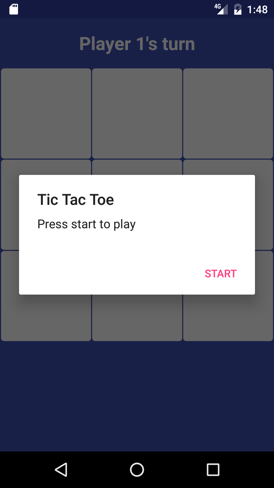
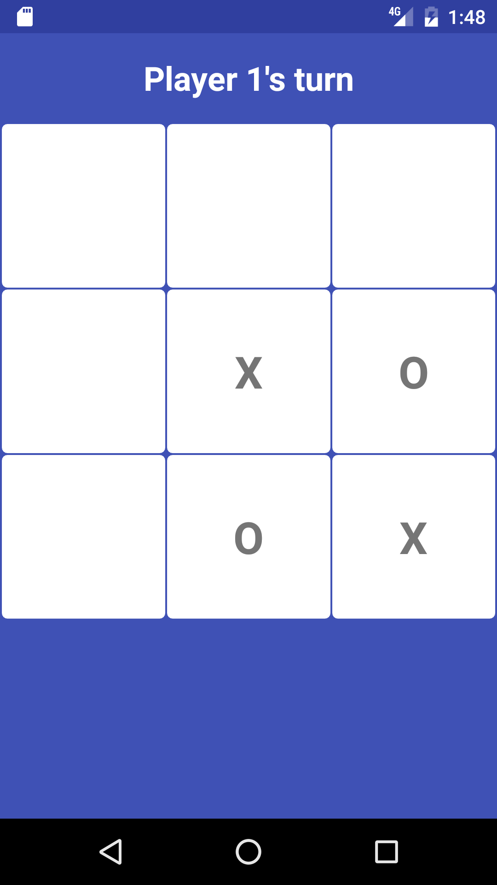
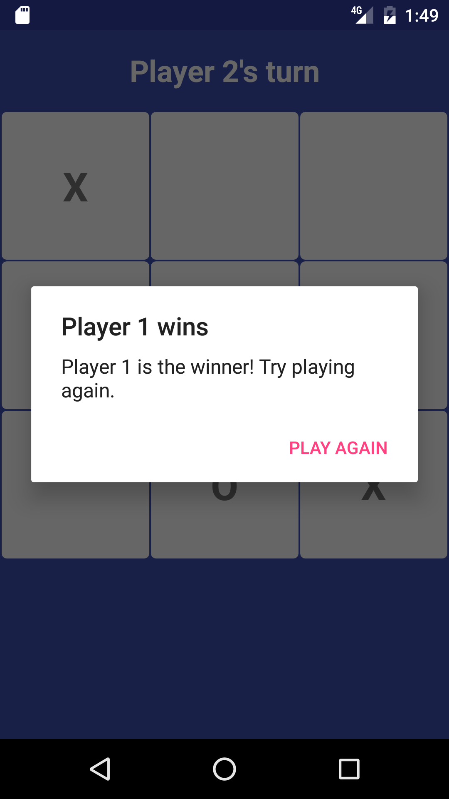
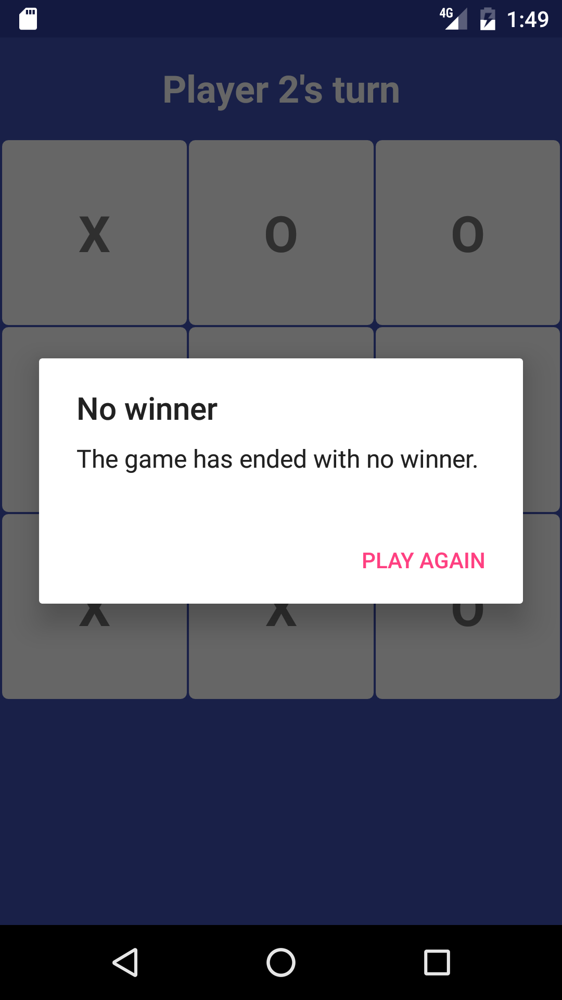

# TicTacToe

This is a simple Tic Tac Toe game written for Android.

# How to use

 - download and install Android Studio
 - clone this repo 
 - open Android Studio and select "Open an existing Android Studio project"
 - navigate to and select the TicTacToe project
 - press 'Run app'
 - the application should start

# Screenshots

 
 